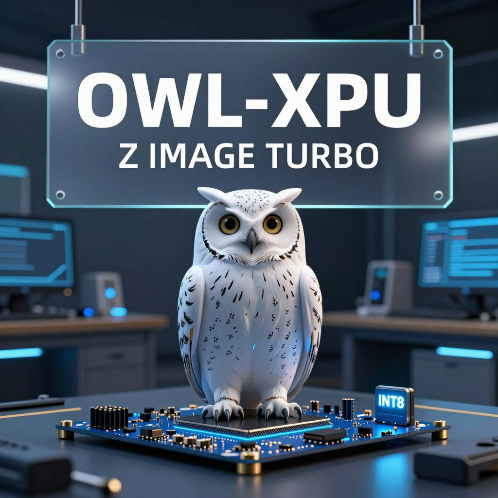
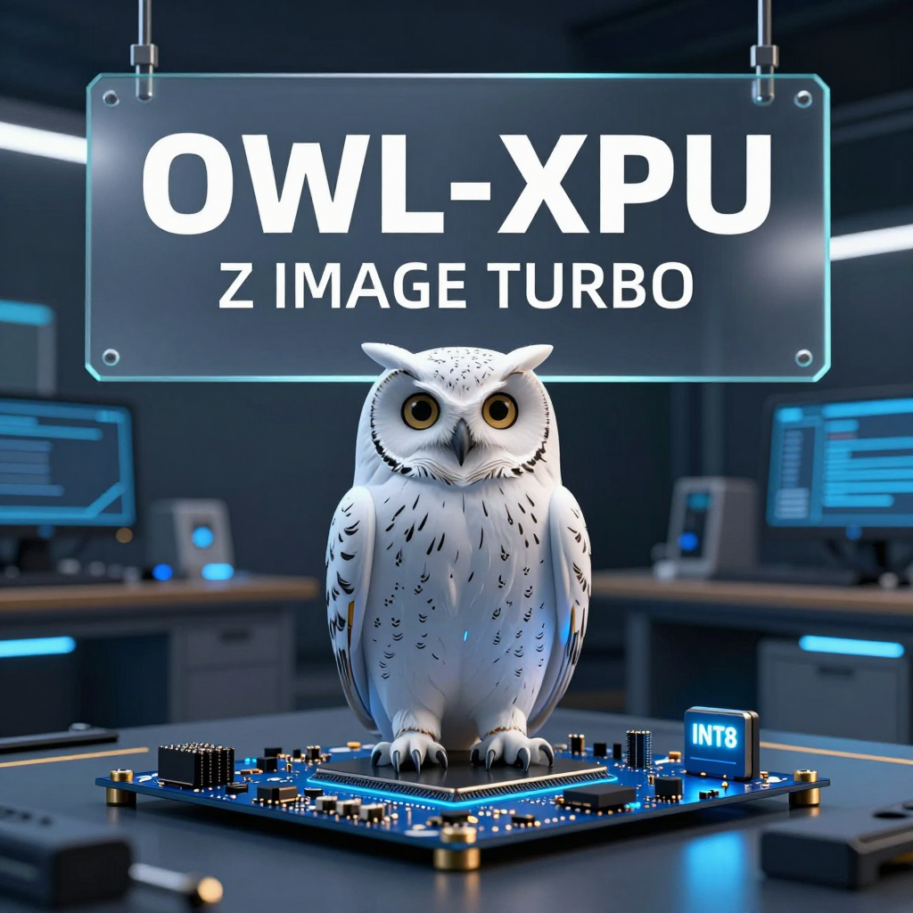
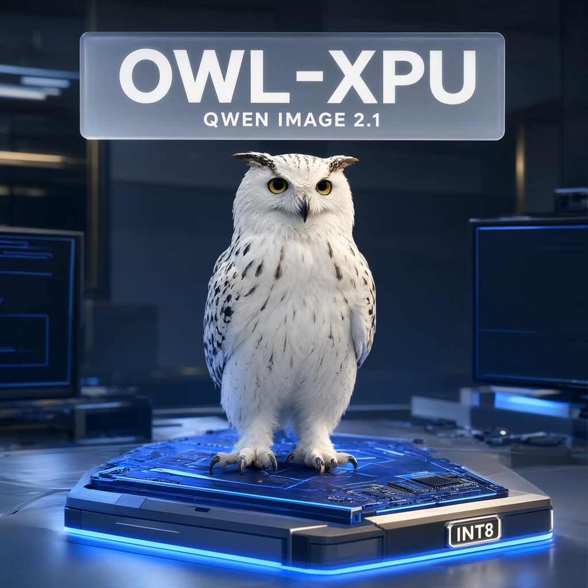
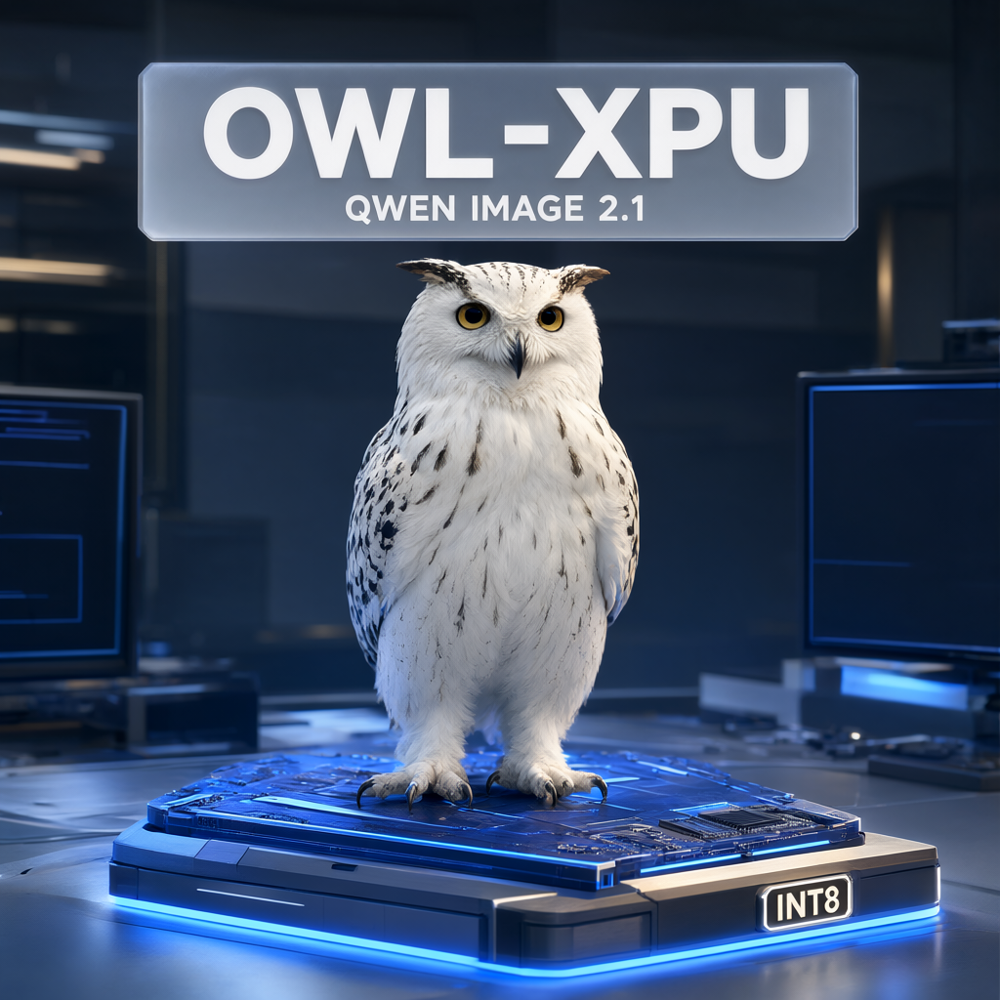
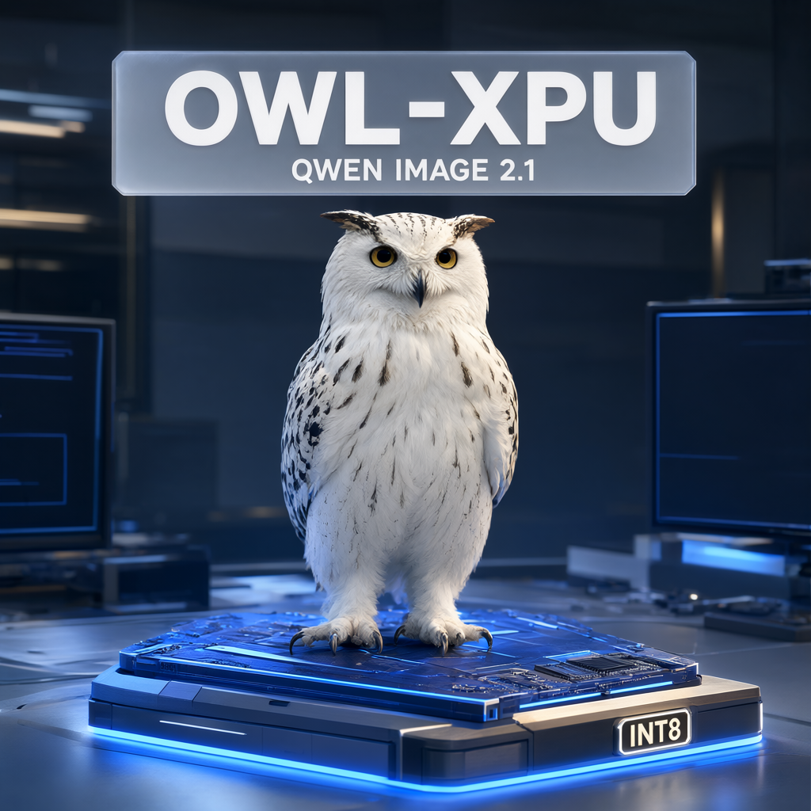

# OWL-XPU

**Omni Workload Layer Runtime for Intel XPU (iGPU/dGPU)**

> [!IMPORTANT]
> **Experimental proof of concept (POC).** OWL-XPU explores a unified approach
> to packaging, integration and validation across operating systems and Intel
> GPU platforms. The goal is a more elegant, maintainable way to deliver
> optimizations for both integrated GPUs (iGPUs) and discrete GPUs (dGPUs),
> with shared component boundaries and explicit platform-specific behavior.
> Packaging workflows and interfaces may evolve as the design is tested.
> Support and optimization coverage remain experimental and vary by OS/device;
> the [support tables](#support-and-validation) distinguish validated results
> from implementation paths and planned work.

OWL-XPU records compatible source combinations and packaging methods for Intel
XPU components used with ComfyUI. Each runtime is maintained in its own
repository and integrated here as a Git submodule. The
[architecture document](docs/architecture.md) defines component responsibilities.

This repository contains **documentation and packaging only**. Native kernels,
operator dispatch, allocator implementations and ComfyUI adapters belong in
the component repositories. Gitlinks pin exact commits; no build follows a
moving branch or downloads an unpinned replacement implementation.

| Submodule | Responsibility |
| --- | --- |
| [components/ComfyUI](https://github.com/Comfy-Org/ComfyUI) | Official ComfyUI host, pinned to v0.37.0 |
| [components/omni_xpu_kernels](https://github.com/shinosawabot/omni_xpu_kernels) | Native Intel XPU kernels, Torch bindings and target capabilities |
| [components/comfy-kitchen](https://github.com/shinosawabot/comfy-kitchen) | Operator APIs, XPU dispatch, input constraints and fallback |
| [components/comfy-aimdo](https://github.com/shinosawabot/comfy-aimdo) | Memory management and allocator lifecycle |
| [components/ComfyUI_OmniXPU](https://github.com/shinosawabot/ComfyUI_OmniXPU) | Provider selection and thin ComfyUI call-site adapters |

The repository keeps the assembly and its application evidence in separate
top-level areas:

- [`packaging/`](packaging/): target profiles, container builders and artifact checks.
- [`workflows/`](workflows/): verified ComfyUI API graphs with no model weights or generated output.
- [`blogs/`](blogs/): practical records from running those graphs with an OWL-built ComfyUI package.
- [`docs/`](docs/): architecture, procedures, support matrices and validation receipts.

## Current status

The OWL-focused [`Z Image Turbo INT8 workflow`](workflows/zimage-turbo-int8-owl-api.json)
and [`Qwen Image 2.1 INT8 workflow`](workflows/qwen-image-2.1-int8-owl-api.json)
were run successfully on each currently validated Linux target with the same
OWL-focused poster structure, model-specific title text, their respective pinned
model files and a two-stage warm execution protocol. The timed value is the ComfyUI `execution_start` to
`execution_success` interval after one same-graph warm-up run.

The common startup configuration for both workflows on all devices was:

```bash
--disable-dynamic-vram --listen 0.0.0.0 --port 8188 --disable-api-nodes
```

|  | B580 | A770 | PTL-H |
| --- | --- | --- | --- |
| Device | B580 / `bmg` | A770 / `dg2` | PTL-H / Arc B390 |
| Example image |  |  |  |
| Generation time | **4.664 s** | **7.987 s** | **12.703 s** |

These values are functional warm-generation records rather than a normalized
performance benchmark: all three use the same DynamicVRAM-off resident startup,
while DG2 uses the core-only PyTorch SDPA attention path and PTL-H uses CUTE
attention. The complete
prompt, graph hash, model hashes, image identities, output hashes and route notes
are in the [full OWL status record](blogs/2026-09-21-zimage-turbo-int8-owl-status.md).

### Qwen Image 2.1 INT8

The [`Qwen Image 2.1 INT8 workflow`](workflows/qwen-image-2.1-int8-owl-api.json)
uses the official INT8 template and model filenames. It uses the same
OWL-focused poster composition and startup configuration as the Z Image record,
with Qwen Image 2.1 named in its title panel.

|  | B580 | A770 | PTL-H |
| --- | --- | --- | --- |
| Device | B580 / `bmg` | A770 / `dg2` | PTL-H / Arc B390 |
| Example image |  |  |  |
| Generation time | **17.415 s** | **27.582 s** | **50.322 s** |

These are functional warm-generation records for the 1024×1024, 25-step Euler
graph. DG2 uses core-only PyTorch SDPA; B580 and PTL-H load CUTE but fall back
for the Qwen attention shape that is outside the current CUTE support set. The
[full Qwen Image 2.1 status record](blogs/2026-09-21-qwen-image-2.1-int8-owl-status.md)
contains the package identities, model hashes, image identities, output hashes
and route notes.

DynamicVRAM is currently recommended as an explicit opt-in for memory-pressure
workflows such as MiniMax H3. Keep it disabled by default for ordinary image
workflows when resident weights fit; an earlier B580 DynamicVRAM validation
run hit a VBAR fault, so enabling it still requires target-specific validation.

## Support and validation

Ubuntu uses the OMIX image build. The planned Windows route enhances the
upstream Intel portable; an OWL Windows installer is not yet available.
Ubuntu/B580 has a historical clean-image receipt for ComfyUI 0.35.0, while the
current ComfyUI 0.37.0 workflow records are shown above. Ubuntu/DG2 and
Ubuntu/PTL-H have focused container and ComfyUI workflow receipts. The tables
describe the current committed component pins (updated 2026-09-21).

Status indicators (always accompanied by text):

- ✅ **Validated**: OWL device checks passed within the documented test scope.
- ❌ **Validated — not supported**: testing confirmed that the component or combination cannot satisfy the required functionality; record the failing case and environment.
- ⚠️ **Validated — not recommended**: required functional checks passed, but measured reliability, performance or resource-use drawbacks make this combination unsuitable for the stated use case; document the reason.
- 🔧 **Validated — needs optimization**: required functional checks passed, but measured performance or resource-use gaps remain; document the optimization targets and baseline.
- 🧩 **Implementation present, unvalidated**: code/build path exists; this OS/device combination has not passed OWL validation.
- 📋 **Target declared, unvalidated**: provider metadata admits the target; functionality is not yet established.
- 🚫 **Missing target support / blocked**: the current component pins cannot provide the complete enhancement.
- ⏳ **Planned / awaiting validation**: delivery or device validation is still pending.

The three qualified validation statuses require device-specific evidence and a
stated test scope. Missing implementation alone is not a validated failure;
suspected slowness alone is not a measured optimization gap. Existing entries
retain their current status until evidence supports reclassification.

### Ubuntu

OMIX image build.

| GPU / target | SYCL/ESIMD + oneDNN (`_C` / `lgrf_sdp`) | CuTe / sycl-tla (`cute_fmha_torch`) | Kitchen XPU provider | AIMDO XPU provider | ComfyUI_OmniXPU adapters | OWL package / combined validation |
| --- | --- | --- | --- | --- | --- | --- |
| B580 / `bmg` | ✅ Validated, 36 RMSNorm cases and 2 ESIMD SDP dtype cases; experimental B580 policy | ✅ Validated, BF16 D128 Z-Image attention correctness ([receipt](docs/b580-kernel-validation.md)); other CuTe routes/performance not covered | ✅ Validated, 40 capabilities registered; INT8 reference case tested | ✅ Validated, native hook and VBAR lifecycle | ✅ Validated, registration and diagnostic graph; conditional adapters can skip | ✅ Validated, OMIX clean-image receipt plus current Z Image Turbo and Qwen Image 2.1 INT8 workflows ([Z record](blogs/2026-09-21-zimage-turbo-int8-owl-status.md), [Qwen record](blogs/2026-09-21-qwen-image-2.1-int8-owl-status.md)) |
| A770 / `dg2` | ✅ Validated, core `_C` wheel and ESIMD RMSNorm exercised; LGRF sidecar is intentionally omitted | ❌ Validated — not supported, DG2 CuTe/LGRF AOT is unavailable; ComfyUI uses PyTorch SDPA | ✅ Validated, DG2 XPU provider active and INT8 calls exercised | 📋 Target declared, not separately validated in the focused workflow | ✅ Validated, INT8 FFN adapter and DG2 attention fallback loaded | ✅ Validated, core-only DG2 profile plus current Z Image Turbo and Qwen Image 2.1 INT8 workflows ([historical receipt](docs/dg2-validation.md), [Z record](blogs/2026-09-21-zimage-turbo-int8-owl-status.md), [Qwen record](blogs/2026-09-21-qwen-image-2.1-int8-owl-status.md)) |
| PTL / `ptl-h` only | ✅ Validated, PTL-H core and LGRF numerical smoke | ✅ Validated, PTL-H CUTE D128 smoke and workflow attention calls | ✅ Validated, PTL-H provider and fused INT8 ConvRot workflow | ✅ Validated, PTL-H provider startup; fused workflow gate uses resident weights | ✅ Validated, PTL-H CUTE, RMSNorm and INT8 FFN adapters | ✅ Validated, PTL-H Torch 2.13 image and current Z Image Turbo plus Qwen Image 2.1 INT8 workflows ([historical receipt](docs/ptl-h-validation.md), [Z record](blogs/2026-09-21-zimage-turbo-int8-owl-status.md), [Qwen record](blogs/2026-09-21-qwen-image-2.1-int8-owl-status.md)) |
| LNL | 🔧 Validated locally, Windows `lnl` core/AOT and ConvRot/RMS/RoPE paths | 🔧 Validated locally for standalone LNL shapes; Qwen attention shape remains on Torch SDPA | 📋 `lnl` provider target declared; Windows wheel path still needs a clean package build | 🧩 Windows native-hook source path present; no stable end-to-end gain in the local AIMDO experiments | 🧩 Generic provider/adapters admit a manifest-declared LNL target; combined workflow acceptance pending | ⏳ `lnl-windows-torch213` profile added; clean package and workflow receipt pending |

### Windows

Official Intel portable enhancement; OWL Windows packaging is planned.

| GPU / target | SYCL/ESIMD + oneDNN (`_C` / `lgrf_sdp`) | CuTe / sycl-tla (`cute_fmha_torch`) | Kitchen XPU provider | AIMDO XPU provider | ComfyUI_OmniXPU adapters | OWL package / combined validation |
| --- | --- | --- | --- | --- | --- | --- |
| B580 / `bmg` | 🧩 Implementation present, unvalidated, Windows BMG build path; existing build guide is scoped to B70, not B580 acceptance | 🧩 BMG CuTe build path; explicit opt-in required; B580 device unvalidated | 📋 Target declared, unvalidated, Windows + `bmg` manifest support | 🧩 Implementation present, unvalidated; Windows native-hook/Detours code and `bmg` eligibility | 🧩 Implementation present, unvalidated, Windows bootstrap path | ⏳ Intel portable enhancement planned; no B580 Windows receipt |
| A770 / `dg2` | 🚫 Missing target support, no `dg2` build target | 🚫 Missing `dg2` CuTe/AOT target | 📋 Target declared, unvalidated, Windows + `dg2`; matching kernel missing | 🧩 Implementation present, unvalidated; Windows hook code and `dg2` eligibility | 🧩 Implementation present, unvalidated, incomplete companion stack | 🚫 Blocked on DG2 kernel path; no receipt |
| PTL / `ptl-h` only | 🧩 Implementation present, unvalidated, core `ptl-h` target path | 🚫 Windows CuTe build explicitly restricted to `bmg` | 📋 Target declared, unvalidated, Windows + `ptl-h` | 🧩 Implementation present, unvalidated; Windows hook code and `ptl-h` eligibility | 🧩 Implementation present, unvalidated, device untested | ⏳ Partial source path; no complete portable bundle or receipt |
| LNL | 🚫 Missing target support, no `lnl` build target | 🚫 Missing `lnl` CuTe/AOT target | 🚫 Missing target support, no `lnl` provider target | 🚫 Missing target support, no `lnl` provider target | 🧩 Implementation present, unvalidated, generic XPU discovery is not LNL acceptance | 🚫 Blocked on target integration; no receipt |

The two kernel columns follow implementation families within one wheel: `_C`
provides SYCL/ESIMD and oneDNN operations, with ESIMD SDP delegated to
`lgrf_sdp`; the separate `cute_fmha_torch` extension provides sycl-tla-based
CuTe FMHA and BMG Sol-Attn. See the [native architecture](docs/architecture.md#native-kernel-architecture).
B580 has correctness evidence for both families; a passing CuTe FMHA case does
not establish coverage of every CuTe/Sol-Attn route or a performance claim.

DG2 is deliberately a core-only profile. Its wheel contains `_C`; the CuTe and
LGRF sidecars are excluded because the DG2 compiler path does not support them.
The ComfyUI adapter therefore keeps attention on native PyTorch SDPA while
routing the supported INT8 ConvRot feed-forward path through OmniXPU.

PTL covers only `ptl-h`. Its focused workflow gate uses resident model weights
with DynamicVRAM disabled; the default DynamicVRAM startup is covered only as
provider startup and model execution with its documented offload fallback.
B580 kernel policy remains experimental; the validated scope is focused
numerical checks and one model workflow, not performance acceptance or complete
model coverage. Windows BMG build code is not a B580 Windows validation result.

See [component evidence and deployment details](docs/platform-validation.md),
the [Ubuntu/B580 validation report](docs/omix-validation.md), and the
[ComfyUI upgrade contract](docs/windows-portable.md#upgrade-acceptance-contract).

## Checkout

The OWL superproject and its four enhancement repositories are public.
Official ComfyUI is public as well.

```bash
git clone https://github.com/shinosawabot/owl-xpu.git
cd owl-xpu
git submodule update --init
python3 packaging/build.py check
python3 packaging/build.py plan
```

Initialization covers the five direct submodules. Kitchen retains
optional upstream CUDA third-party submodules, which its XPU-only packaging path
does not use. There is no need to download those for this recipe.

## Package

In a prepared Linux development environment with matching Torch XPU, oneAPI and
oneDNN; the BMG and PTL-H commands also require pinned sycl-tla headers:

All three target profiles use the same Torch/oneDNN packaging interface. BMG
and PTL-H require the pinned sycl-tla checkout for CuTe; DG2 is deliberately a
core-only profile and omits that argument because its profile sets
`require_cute` to `false`.

```bash
python packaging/build.py build \
  --profile packaging/profiles/bmg-torch213.json \
  --sycl-tla /path/to/pinned/sycl-tla \
  --output dist/bmg-torch213
```

For the DG2/A770 core-only profile, use the dedicated profile and omit the
CuTe header checkout:

```bash
python packaging/build.py build \
  --profile packaging/profiles/dg2-torch213.json \
  --output dist/dg2-torch213
```

For the validated Linux PTL-H profile, keep the pinned sycl-tla checkout:

```bash
python packaging/build.py build \
  --profile packaging/profiles/ptl-h-torch213.json \
  --sycl-tla /path/to/pinned/sycl-tla \
  --output dist/ptl-h-torch213
```

The result contains the native kernel wheel, separately packaged Kitchen/AIMDO
XPU provider wheels, a ComfyUI custom-node ZIP and a SHA256 manifest. Native builds
run in fresh source copies under the ignored output directory; the submodule
working trees remain unchanged. The command never uploads or publishes artifacts.

See [packaging instructions](docs/packaging.md),
[architecture](docs/architecture.md), and [updating components](docs/development.md).

## Build from clean OMIX

The current scripts target **Ubuntu x86-64**: the container uses Ubuntu 24.04,
and the validated host runs Ubuntu 24.10. Other host distributions, Windows and
macOS have not been validated with this recipe.

No preinstalled Omni kernel or existing development image is required. With
Docker and Python 3 on the host, from a clean checkout with all five direct submodules initialized:

```bash
python3 packaging/container/build_image.py \
  --no-cache --work-dir /absolute/path/to/new-build-directory
python3 packaging/container/verify_image.py \
  --pci 0000:03:00.0 --ze-affinity 0 \
  --output /absolute/path/to/new-validation-directory
```

The device arguments above describe the tested local B580; confirm them for your
host. See [the complete OMIX recipe](docs/omix-container.md) for prerequisites,
build stages and launch/export commands. The [clean-build validation report](docs/omix-validation.md) records the tested image, checks and limits.

## Package scope

See the [Ubuntu/Windows device and component matrix](docs/platform-validation.md)
for B580, A770, PTL and LNL. Ubuntu uses the OMIX build; the planned Windows
route enhances the official Intel portable. The
[upgrade contract](docs/windows-portable.md#upgrade-acceptance-contract) requires
compatible ComfyUI upgrades to preserve adapter and component behavior.

This is a submodule-based assembly and a BMG/DG2/PTL-H/Torch 2.13 development
packaging recipe. The DG2 and PTL-H receipts and workflow records cover the
validated Z Image Turbo and Qwen Image 2.1 INT8 graphs; they do not establish
complete model coverage or performance parity. LNL remains a future target
direction and requires its own
implementation and device validation.

Build and verification evidence is described in the
[validation report](docs/omix-validation.md).
Component licenses and attribution remain in each submodule; the root
Apache-2.0 license covers this assembly's new
documentation and packaging code.
