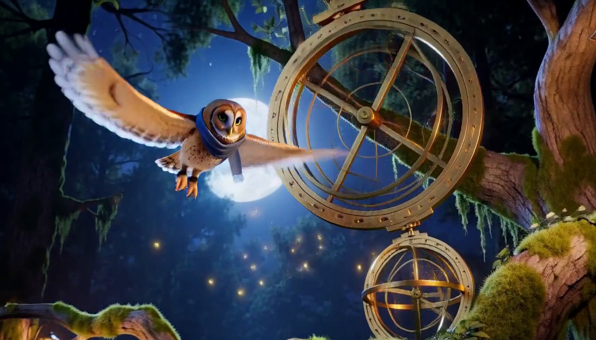

# MiniMax H3 VSA 4-step OWL status

This record runs the MiniMax H3 VSA 4-step video workflow through the current
OWL-XPU BMG package on a local Intel B580. It records a successful five-second
video generation with the OWL-focused scene prompt, DynamicVRAM enabled for the
memory-pressure workflow, and the current ComfyUI 0.37.0 component pins.

## Workflow and prompt

- Workflow: [`minimax-h3-vsa-4step-owl-api.json`](../workflows/minimax-h3-vsa-4step-owl-api.json)
- Workflow SHA256: `e90ce64fd8a8d79d2b971ea8f6f7a3f81dabde5ca20c7de121b740f61bca554d`
- Resolution: 1344×768, batch 1
- Duration: 5 seconds, 124 frames at 24 fps
- Diffusion sampling: `euler`, `simple`, 4 steps
- VSA: `selection=vsa`, `selection.keep_percent=10.0`, `min_tokens=12288`,
  `sink_conditioning=exact_kv_and_rows`, `extra_tokens=0`
- MiniMax H3 sigma shift: video `12.0`, audio `3.0`
- Warm-up seed: `556589502035082`; timed seed: `556589502035083`

The exact OWL-focused prompt is:

```text
integrated_multimodal_description: [Shot 1] Cinematic stylized 3D animation, a small tawny owl with a cream facial disk, amber eyes, and a cobalt-blue scarf stands on a moss-covered brass observatory branch in a moonlit forest. The camera begins in a low-angle medium-wide shot, then tracks forward and arcs smoothly around the owl. The owl spreads both wings, launches from the branch, glides past glowing astrolabes and floating fireflies, and lands on a stone perch close to camera. It turns its head toward the viewer and blinks once; feather layers, scarf, and firefly particles respond naturally to the airflow. Rich 3D materials, clear silhouette, physically plausible wing motion, volumetric blue moonlight with warm lantern rim light, shallow depth of field, feature-film-quality animation. The owl gives one soft hoot on landing. No text, logos, watermark, or extra animals.

overall_soundscape: Gentle wing flaps, feather rustle, nighttime forest wind, tiny brass mechanism clicks, a soft stone landing, and one clear owl hoot.

non_diegetic_music: Sparse celesta and pizzicato strings at first, joined by warm low percussion during takeoff, then resolving with a soft chime on landing.
```

The read-only model files were:

| File | Size | SHA256 |
| --- | ---: | --- |
| `diffusion_models/minimax_h3_fastvideo_vsa_datafree_1300step_4step_int8_convrot.safetensors` | 22,898,594,920 bytes | `7221ae65d78780354d51e5048d29728d9f1f8fb9baf50b1dd3df85f5101413d3` |
| `text_encoders/qwen3vl_32b_minimax_h3_nvfp4_awq.safetensors` | 15,687,142,551 bytes | `35a88d51044231fe332301d7a62aa81e3f2cba62febeb446e2c1e3e0ef76f2c6` |
| `vae/minimax_h3_video_vae_fp16.safetensors` | 5,207,808,496 bytes | `7c1f131492e7eddacaac9069a61b81bdd39de5cc96561e677c5eab1cdce5e522` |
| `vae/minimax_h3_audio_vae_fp32.safetensors` | 605,254,808 bytes | `8e505d95dd1561d47abd43d4238fd40d9bb1ae9e147ed0a4cba778d76ae4db48` |

## Package and startup

The package was built from the current root checkout with the BMG Torch 2.13
profile:

| Component | Revision or runtime version |
| --- | --- |
| OWL-XPU root | `d658d79ec9dca41fdeb67bf72f79fe426341cddd` |
| `omni_xpu_kernels` | `4861cd02414e9e58e2368459737bd96ada21c199` |
| `comfy-kitchen` | `e4e8ef8c241ebb8a41106355ce73eb05a2e1ddca` / runtime `0.2.35` |
| `comfy-aimdo` | `874b805f032a213284170b6f5a2f11f6373c135d` / runtime `0.5.5` |
| `ComfyUI_OmniXPU` | `83c26e612830c6b0b4c122e3a7525fb9fcce25d6` |
| Official ComfyUI | `73c9bad4d21e7addbe1d13bc92eee0f1431b017d` / `0.37.0` |
| Container image | `owl-xpu:comfyui-0.37.0-bmg-h3`, local image ID `sha256:f89892269bafedc5ea5bb6b47b80dd15dc54e3872906bd9d95746144e98abbce` |

The ComfyUI container used the following runtime options in addition to the
`/dev/dri` device and read-only model mount:

```text
--listen 0.0.0.0 --port 8188 --disable-auto-launch \
--enable-dynamic-vram --reserve-vram 4
```

The container used `ZE_AFFINITY_MASK=0`, a 1 GiB shared-memory area and a
separate output mount. This is a B580 functional record for a memory-pressure
workflow; it does not establish MiniMax H3 support on DG2, PTL-H or LNL.

## Result

The API runner submitted the graph once for warm-up and once for the timed
execution while keeping the ComfyUI service resident. The warm-up completed in
278.110 seconds of server execution time (278.282 seconds client wall time).
The timed execution completed in **202.238 seconds** of server execution time
(203.061 seconds client wall time). The timed value is the ComfyUI
`execution_start` to `execution_success` interval after warm-up.

| Device | Package and startup | Warm generation | Output SHA256 | Sample | Route and notes |
| --- | --- | ---: | --- | --- | --- |
| B580 / `bmg` | `owl-xpu:comfyui-0.37.0-bmg-h3`<br>`--enable-dynamic-vram --reserve-vram 4` | **202.238 s** server / 203.061 s client | `842546b4997088976ea24b42ac642f4f6265db4b35629adccd8135806913c3d7` | [Representative frame](assets/minimax-h3-vsa-4step-owl-b580.png) | H3 segmented RMS modulation and H3 sigma-shift adapters loaded. Main H3 attention used the experimental BMG D128 CUTE route (`heads=56`, `q=267`, `kv=267`); VAE decode logged the existing batch-4, sequence-1797 fallback. |

The output was an H.264/AAC MP4 at 1344×768, 24 fps, 124 video frames,
5.167 seconds, with two-channel 32 kHz audio. The frame stored with this record
was extracted at 2.5 seconds from the timed output and has SHA256
`f6c671405bb877d415cce19a17a3b25a88e80cd3e36a35d7ee3c7f4b14ca68a2`.

The timed run completed without an execution error or out-of-memory event. The
generated scene keeps the owl as the visual subject and contains no requested
text, logos or watermark, so it avoids the text-rendering failure mode of the
earlier image examples.

## Generated example



