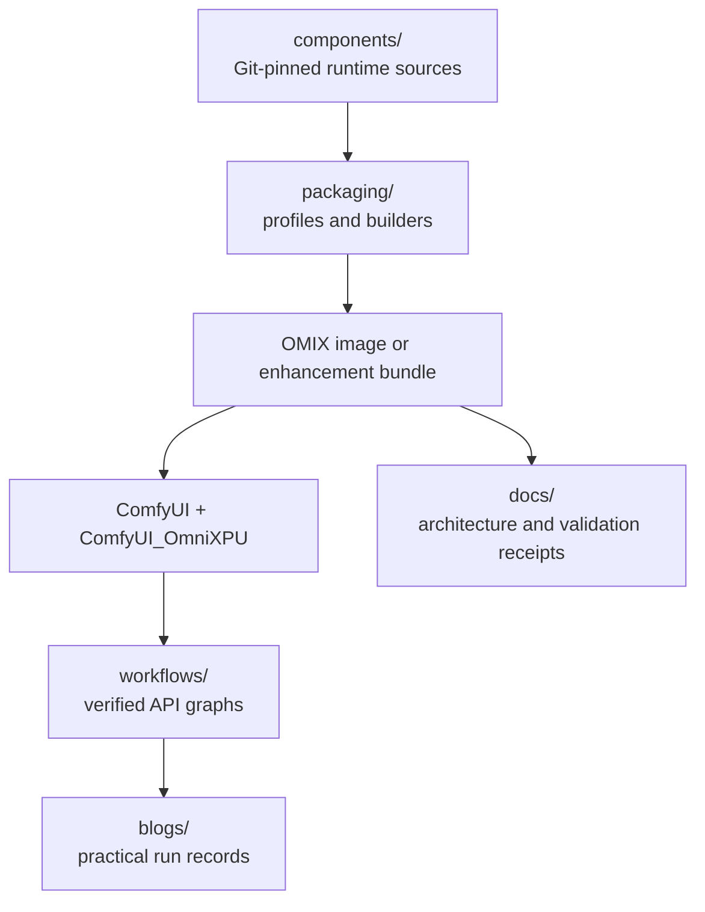

# Ownership and runtime boundaries

## Repository map

OWL-XPU separates source components, reproducible assembly, tested workflow
graphs and application records:



The top-level directories have different ownership:

| Directory | Owns | Does not own |
| --- | --- | --- |
| `components/` | Git submodules containing ComfyUI, native kernels, Kitchen, AIMDO and the OmniXPU adapter | Root package pins, model files or workflow results |
| `packaging/` | Target profiles, container recipes, artifact manifests and source-admission checks | Runtime implementation code |
| `workflows/` | ComfyUI API-format graphs that have passed a documented OWL package validation | Checkpoints, generated media, server logs or unverified experiments |
| `blogs/` | Human-readable records of actual workflows run with an OWL-built ComfyUI environment, plus small generated sample assets | Model weights, credentials, machine-local logs or a second source of truth for component revisions or support status |
| `docs/` | Architecture, procedures, support matrices and focused validation receipts | Mutable run output and local machine state |

`workflows/` is the reusable input layer. A graph is admitted only after a
validation receipt or blog records its graph hash, model identities, package
pins, target device and result. `blogs/` is the application layer: it explains
what was run, how the packaged environment behaved and which limits remain. The
package profile, committed gitlinks and validation receipts remain authoritative
for reproducibility; a blog links to them instead of duplicating ownership.

```text
OWL-XPU (documentation, gitlinks, packaging profiles and artifact manifests)
  +-- ComfyUI: official application host (v0.35.0)
  +-- ComfyUI_OmniXPU: prestartup selection and ComfyUI-specific adapters
  +-- comfy-kitchen: common operator interfaces and per-call dispatch
  +-- comfy-aimdo: allocator and model-weight lifecycle
  +-- omni_xpu_kernels: native operators, bindings and device capabilities
```

ComfyUI uses native kernels through Kitchen or a dedicated adapter. Native
kernels remain independent of ComfyUI, Kitchen and AIMDO. Generic operator
dispatch belongs to Kitchen; memory lifecycle belongs to AIMDO. The integration
node must not duplicate Kitchen registrations or replace workflow semantics.

Official `comfy-kitchen` and `comfy-aimdo` distributions coexist with the optional
`comfy-kitchen-xpu-runtime` and `comfy-aimdo-xpu-runtime` providers. Provider wheels
own private vendor paths rather than overwriting official package files.
ComfyUI prestartup selects one canonical runtime per namespace after compatibility
checks. Kitchen and AIMDO activation remain independent; AIMDO also requires
explicit DynamicVRAM enablement and its allocator-lifecycle admission.

OWL does not implement this behavior. It invokes the component packaging entry
points and records their exact gitlink revisions. The `omni_xpu_kernel` Python
import/distribution name remains unchanged despite the repository's plural name.

The superproject may track root metadata, `docs/`, `packaging/`, `workflows/`,
`blogs/` and component gitlinks. It does not vendor runtime source, local
wheel/DSO files, models or machine-specific device ordinals.
`packaging/build.py check` enforces this layout.
Gitlinks are the only source-version authority; build manifests derive their
component revisions from them rather than maintaining a second lock file.

The container recipe includes official ComfyUI through its pinned submodule and
bootstraps the toolchain from OMIX. The enhancement-only recipe can still target
an existing compatible ComfyUI installation. Any additional runtime project must
likewise be a reviewed, pinned submodule. sycl-tla is an
external build-time header checkout whose required commit is specified in the
packaging profile and verified before a kernel build.

Measurement contracts and evidence must be recorded for each tested device;
see the [current validation report](omix-validation.md) for the supported scope.
Reusing a build target or a package version does not transfer roofline ceilings,
numerical acceptance or workflow support across devices.

## Native kernel architecture

`omni_xpu_kernel` is one Python distribution containing three native artifacts.
The homepage uses two implementation-family columns; it does not introduce new
packages or imply that every API in a family has the same validation coverage.

| Native artifact | Loading and API boundary | Implementation / dependency | Homepage column |
| --- | --- | --- | --- |
| `_C` | Lazily imported by the Python wrappers; exposes norm, quantization, GEMM, rotary, layout and SDP bindings | Native SYCL/ESIMD operations and direct oneDNN calls; the SDP binding delegates to `lgrf_sdp` | SYCL/ESIMD + oneDNN |
| `lgrf_uni/lgrf_sdp` | Loaded by `_C`'s SDP bridge through the OS library loader; reached through `omni_xpu_kernel.sdp.sdp` | Separately compiled ESIMD attention library with large-GRF compilation settings | SYCL/ESIMD + oneDNN |
| `cute/cute_fmha_torch` | Independently loaded with `torch.ops.load_library` by `omni_xpu_kernel.cute` | sycl-tla/CUTLASS-SYCL FMHA; BMG builds also include sparse Sol-Attn sources | CuTe / sycl-tla |

Thus `sdp.sdp` and `cute.sdp` are different attention backends, not synonyms.
The former passes through `_C` to the ESIMD library; the latter dispatches to
CuTe Torch operators. Specialized CuTe APIs have separate shape/layout and
capability gates (D120, D128, structural D64 and BMG-specific sparse/cross-attention
routes). A successful test of one entry point does not validate all of them.

Build-target eligibility (`bmg`, `ptl-h`), native ABI compatibility, physical-SKU
runtime policy and device test results are separate properties. BMG CuTe uses
G21/G31 AOT images, while exact Device ID selects runtime policy. B580's policy
can remain experimental even when a specific CuTe correctness contract passes.
The oneDNN dependency belongs to `_C`; sycl-tla is the build-time header dependency
for the CuTe extension, not a replacement for the entire kernel package.

Sources checked for these boundaries:

- [Package architecture](../components/omni_xpu_kernels/ARCHITECTURE.md) and
  [API/build documentation](../components/omni_xpu_kernels/UPSTREAM_README.md)
- [Extension build definitions](../components/omni_xpu_kernels/setup.py)
- [ESIMD SDP wrapper](../components/omni_xpu_kernels/omni_xpu_kernel/sdp/__init__.py)
  and [native library bridge](../components/omni_xpu_kernels/omni_xpu_kernel/csrc/sdp.cpp)
- [CuTe wrapper and capability gates](../components/omni_xpu_kernels/omni_xpu_kernel/cute/__init__.py)
- [B580 correctness evidence](b580-kernel-validation.md)
